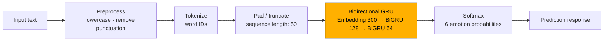
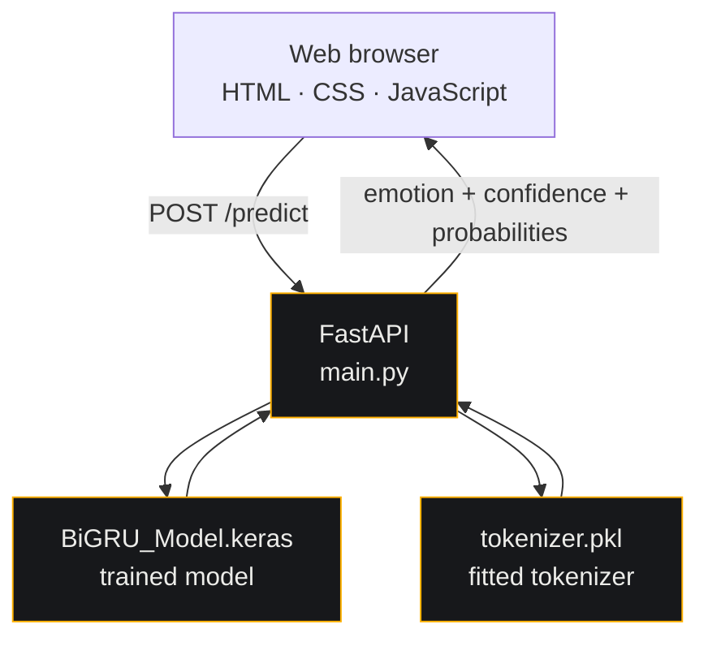
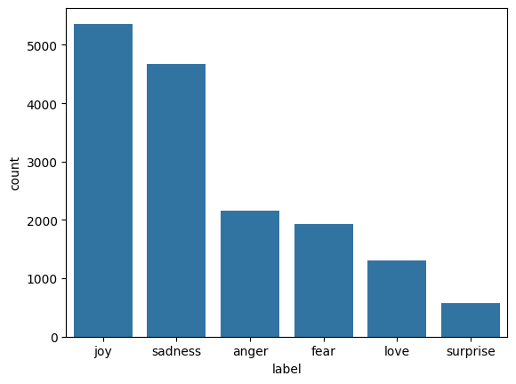
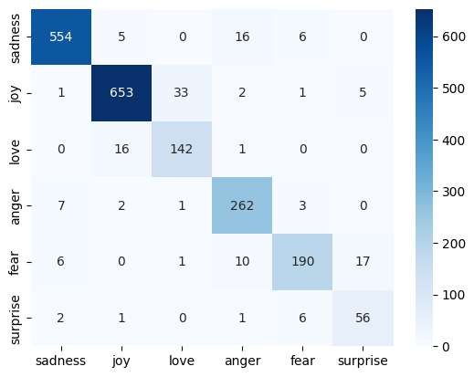

<div align="center">


</div>

<br/>

## What is AFFECT?

A sentence goes in, six probabilities come out.

**AFFECT** is an end-to-end text emotion classifier built around a Bidirectional GRU neural network. It is trained on the [`dair-ai/emotion`](https://huggingface.co/datasets/dair-ai/emotion) dataset and exposed through a FastAPI backend with a custom dark/light frontend built using plain HTML, CSS, and JavaScript.

The application predicts one of six emotions:

**😢 Sadness · 😄 Joy · ❤️ Love · 😠 Anger · 😨 Fear · 😲 Surprise**

<div align="center">

| | |
|---|---|
| 🧠 **Model** | Bidirectional GRU (Keras / TensorFlow) |
| 🎯 **Task** | 6-class text emotion classification |
| 📊 **Test accuracy** | **92.85%** |
| 📉 **Test loss** | **0.196** |
| 🗂️ **Dataset** | `dair-ai/emotion` (~20k labelled sentences) |
| ⚙️ **Backend** | FastAPI · Uvicorn |
| 🎨 **Frontend** | Vanilla HTML / CSS / JavaScript |

</div>

<br/>

## ✨ Highlights

- 🔡 **Six-class emotion prediction** — returns the predicted emotion together with the complete probability distribution.
- 🧠 **Bidirectional GRU architecture** — uses context from both directions of the input sequence.
- 🧪 **Model comparison** — Simple RNN, LSTM, GRU, and Bidirectional GRU architectures were evaluated before selecting the final model.
- ⚖️ **Class-weighted training** — balanced class weights were used to account for the uneven class distribution in the training data.
- 🛑 **Early stopping** — training restores the best-performing weights when the monitored loss stops improving.
- ⚡ **FastAPI inference API** — a simple `/predict` endpoint provides the prediction, confidence, and probability breakdown.
- 🖥️ **Framework-free frontend** — includes a probability visualization, dark/light themes, and sample prompts without a frontend build system.

<br/>

## 🧬 How classification works



The same preprocessing used by the API is applied before inference: text is lowercased, apostrophes and special characters are removed, extra whitespace is normalized, the fitted tokenizer converts words to integer IDs, and the sequence is padded or truncated to a maximum length of 50.

<br/>

## 🏗️ System architecture



The trained model and tokenizer are loaded when the FastAPI application starts, so they can be reused across prediction requests rather than loaded for every request.

<br/>

## 🛠️ Tech stack

<div align="center">

**Machine Learning**


**Backend**


**Frontend**


**Deployment**


</div>

<br/>

## 📊 Model results

Four recurrent architectures were evaluated using the same general training setup: an embedding layer, recurrent layers, dropout, a softmax output layer, Adam optimization, balanced class weights, and early stopping.

| Model | Test Accuracy | Test Loss |
|---|:---:|:---:|
| Simple RNN | 26.60% | 1.735 |
| LSTM | 11.20% | 1.805 |
| GRU | 8.20% | 1.801 |
| **Bidirectional GRU** ✅ | **92.85%** | **0.196** |

The final Bidirectional GRU uses a **300-dimensional embedding**, followed by Bidirectional GRU layers with **128** and **64** units.

<details>
<summary><b>Per-class recall</b></summary>

<br/>

| Emotion | Recall |
|---|:---:|
| sadness | 95.4% |
| joy | 94.0% |
| anger | 95.3% |
| love | 89.3% |
| fear | 84.8% |
| surprise | 84.8% |

`fear` and `surprise` are the most challenging classes in the reported evaluation.

</details>

<div align="center">
<table>
<tr>
<td align="center" width="50%">
<br/>
<sub>Class distribution in the training data</sub>
</td>
<td align="center" width="50%">
<br/>
<sub>Confusion matrix for the final BiGRU model</sub>
</td>
</tr>
</table>
</div>

<br/>

## 🎯 Example

**Input**

> I just found out I passed my board exams on the first try!

**Prediction**

`joy` 😄

**Confidence**

`0.97`

The API also returns probabilities for all six emotions, allowing the result to be viewed as a distribution rather than only a single label.

<br/>

## 📡 API reference

| Route | Method | Body | Returns |
|---|---|---|---|
| `/` | `GET` | — | Serves `static/index.html` |
| `/health` | `GET` | — | `{ status, model_loaded }` |
| `/predict` | `POST` | `{ "text": "..." }` | `{ text, predicted_emotion, confidence, all_probabilites }` |

## 📁 Project structure

```text
.
├── main.py
├── requirements.txt
├── runtime.txt
├── .gitignore
├── README.md
├── emotion_classification.ipynb
├── assets/
│   ├── confusion_matrix.png
│   ├── label_distribution.png
├── Artifacts/
│   ├── BiGRU_Model.keras
│   └── tokenizer.pkl
└── static/
    ├── index.html
    ├── style.css
    └── script.js
```

### Key files

| File / Directory | Purpose |
|---|---|
| `main.py` | FastAPI application and inference endpoints |
| `emotion_classification.ipynb` | Dataset preparation, preprocessing, model training, comparison, and evaluation |
| `Artifacts/BiGRU_Model.keras` | Trained Bidirectional GRU model |
| `Artifacts/tokenizer.pkl` | Fitted text tokenizer used during inference |
| `static/` | Frontend interface |
| `requirements.txt` | Python dependencies |
| `runtime.txt` | Python runtime configuration |

<br/>

## ▶️ Run locally

A local installation can be used to explore the web interface or call the API directly.

> TensorFlow support for Python versions can vary. The project uses a Python 3.11/3.12-compatible environment.

```bash
python3.12 -m venv venv
source venv/bin/activate        # Windows: venv\Scripts\activate

pip install --upgrade pip
pip install -r requirements.txt

uvicorn main:app --reload
```

Then open:

**http://127.0.0.1:8000/**

The API is also available at the same address, with the interactive FastAPI documentation at `/docs`.

<br/>

## 📚 Project workflow

The project covers the complete path from dataset to deployed inference:

```text
Emotion dataset
      ↓
Exploratory analysis
      ↓
Text preprocessing & tokenization
      ↓
Sequence padding
      ↓
Model comparison
      ↓
Bidirectional GRU selection
      ↓
Evaluation & confusion matrix
      ↓
Saved model + tokenizer
      ↓
FastAPI inference
      ↓
Web interface
```

<br/>

## 📄 Author

**Rakshat Tiwari**
